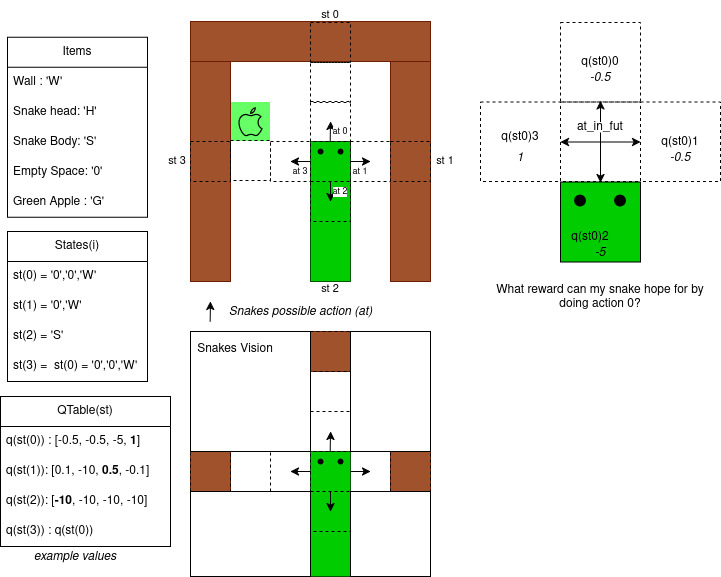

# Q-Learning in Snake

This project explores reinforcement learning through the **Q-learning function**.  
Here are the rules:

- The game mimics a snake, the snakes needs to reach a size of 10 in order to win the game.  
- To grow the snake needs to eat green apples, red apples make him smaller.  
- If the snake reaches a null length, goes into a wall, eats himself, he dies.

TODO :

- Verify saving the model
- Verify loading the model
- Add time count
- Save stats in model
- place snake randomly
