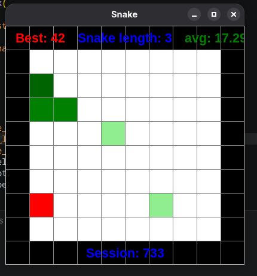

# Q-Learning in Snake



This project explores reinforcement learning through the **Q-learning function**.  
Here are the rules:

- The game mimics a snake, the snakes needs to reach a size of 10 in order to win the game.
- The snake spawns randomly on the board
- To grow the snake needs to eat green apples, red apples make him smaller.  
- If the snake reaches a null length, goes into a wall, eats himself, he dies.

## Use
```bash
➜  src git:(main) python3 main.py --help                               
usage: main.py [-h] [--no-display] [--src SRC] [--dst DST] [--timer TIMER]
               [--sessions SESSIONS] [--map-size MAP_SIZE] [--no-learn] [--walls]

options:
  -h, --help           show this help message and exit
  --no-display         Disable display
  --src SRC            Use source model (npy)
  --dst DST            Stores destination file model (npy)
  --timer TIMER        Time between each loop in milliseconds
  --sessions SESSIONS  Number of training sessions
  --map-size MAP_SIZE  Number of cells on the map
  --no-learn           No q values updated
  --walls              Spawns random walls
```

## Model


The model will **estimate what will be the best future action in a given state** *(at_in_fut: action in future)*, that estimate will sometimes be chosen randomly: 10 percent of the time, of when the state doesn't exist in the q table.  
Howewer, **whether it is true or not, it will influence the q value of that specific choice**. This allows to introduce a random factor without it being destructive (ie go into a wall).
